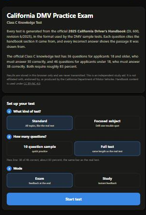
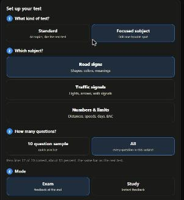
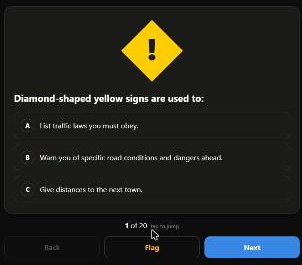

<h1 align="center">CA DMV Practice Test</h1>

  Unofficial practice tests for the <strong>California Class C knowledge test</strong>, 
  generated from the official 2025 California Driver's Handbook (DL&nbsp;600).

  <a href="https://diazjohnt.github.io/dmv-ca-prep/"><strong>Take a practice test →</strong></a>

  
  
  

  
  &nbsp;
  
  &nbsp;
  

## Features

- **A fresh test every time.** Each test is drawn from a bank of 422 hand-written
  questions in the DMV's own three-choice style, balanced across all 16 handbook
  topics. Answer order is shuffled on every display, and recently seen questions
  are rotated out.
- **One setup panel that cascades.** Pick the kind of test → the subject (if
  focused) → how many questions → exam or study. Later steps adapt to earlier
  ones, so the options on screen are always valid.
- **Standard or focused.** A **Standard** test spans every topic like the real
  exam. A **Focused subject** test drills one trouble spot: **road signs**,
  **traffic signals**, or **numbers & limits** (distances, speeds, waiting
  periods, dollar amounts, BAC). Subject pools are curated in the data, so a
  numbers drill never serves a question that merely happens to contain a digit.
- **Real pass lines.** Choose a **10 question sample** or the **full test**
  (46 questions, pass = 38). Focused subjects offer the sample or **All** of
  that subject. The bar is always about 83%, same as the real exam.
- **Exam and Study modes.** Exam gives feedback at the end, like the real thing.
  Study explains every answer the moment you pick it.
- **The handbook teaches you.** Every question cites its handbook section, and
  wrong answers open a *"What the handbook says"* panel with the verbatim source
  passage. Searchable against the official PDF.
- **Progress tracking, no account.** Standard tests build a readiness trend
  against the pass bar; focused sessions stay out of that trend but feed
  per-topic accuracy and a drill built from everything you've missed. All of it
  is stored only in your browser. Nothing is sent anywhere.
- **Built for phones.** Installable to your home screen, ~85 KB compressed on
  first load, fully offline after that.

## How it works

The site is intentionally boring technology: static HTML, CSS, and vanilla
JavaScript, no frameworks, no build step, no server, no database.

| Path | Purpose |
|---|---|
| `docs/` | The entire app, served by GitHub Pages. |
| `docs/questions.js` | The question bank: 422 questions with explanations and handbook references. |
| `docs/handbook.js` | Auto-generated verbatim handbook passages (one per referenced section). |
| `tools/validate.ps1` | Structural checks for the question bank. |
| `tools/logic-test.js` | Node tests for test generation, scoring, and excerpt coverage. |
| `tools/build-excerpts.js` | Regenerates `handbook.js` from the handbook's extracted text. |
| `appendix/` | The official 2025 handbook PDF: the single source of truth. |

Question convention: the correct answer is always written first in the data
(`answer: 0`); the app shuffles choices at display time. After editing
questions, run `powershell -File tools\validate.ps1` and
`node tools\logic-test.js`.

## Accuracy

Questions and answers were written against the California Driver's Handbook
(DL 600, rev. 6/2025) and each cites its section. The real knowledge test is
36 questions (pass with 30) for adults and 46 (pass with 38) for minors. About 83% either way. This is a study aid, not an official DMV product; for
current rules, see [dmv.ca.gov](https://www.dmv.ca.gov/).

## License

Code is [MIT](LICENSE). Question and excerpt content is adapted from the
*California Driver's Handbook*, © California DMV, under
[CC BY-NC 4.0](https://creativecommons.org/licenses/by-nc/4.0/). Non-commercial use with attribution.
